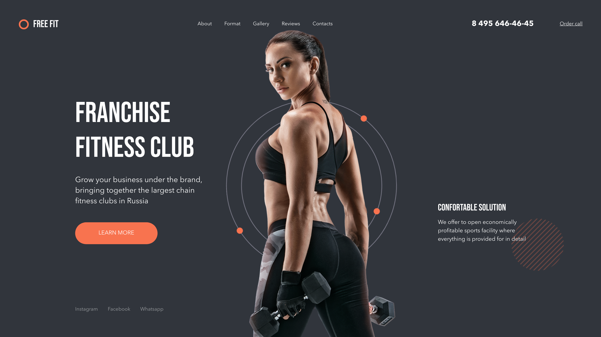
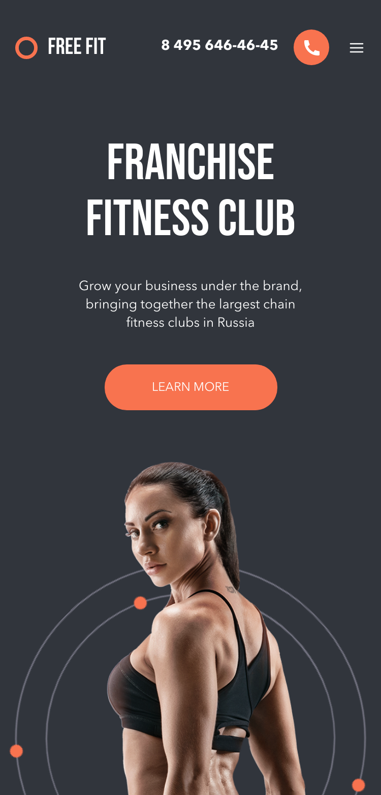
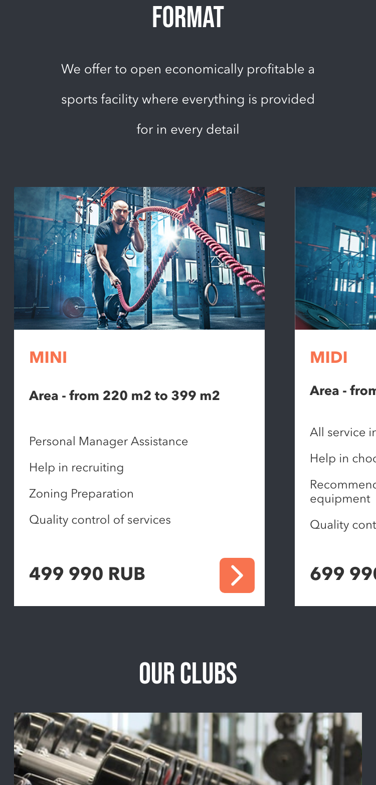
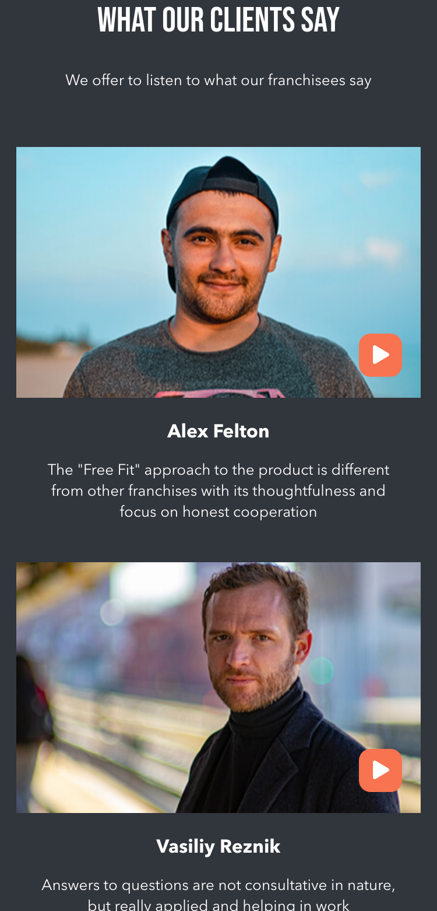

<h1 align="center">
     FREE FIT
</h1>



<div align="center">
  
  
  
</div>

<h3 align="center">
    <a href="https://alancoosta-freefit.netlify.app/">Acessar a demonstração</a>
<h3 >

# Indice

- [Indice](#indice)
  - [🔖 Sobre](#-sobre)
  - [🚀 Tecnologias utilizadas](#-tecnologias-utilizadas)
  - [🗂 Como baixar o projeto](#-como-baixar-o-projeto)

## 🔖 Sobre

O projeto **Free Fit** é um projeto que encontrei no site [Behance](https://www.behance.net/gallery/94841485/Landing-page-for-Fitness-Club-Franchise) e fiz para praticar.

---

## 🚀 Tecnologias utilizadas

O projeto foi desenvolvido utilizando as seguintes tecnologias

- [ReactJS](https://reactjs.org)
- [TypeScript](https://www.typescriptlang.org/)

---

## 🗂 Como baixar o projeto

```bash
    # Clonar o repositório
    $ git@github.com:AlanCoosta/freefit.git

    # Entrar no diretório
    $ cd freefit

    # Instalar as dependências
    $ yarn install

    # Iniciar o projeto
    $ yarn start
```

---

Desenvolvido 💜 por Alan Costa
